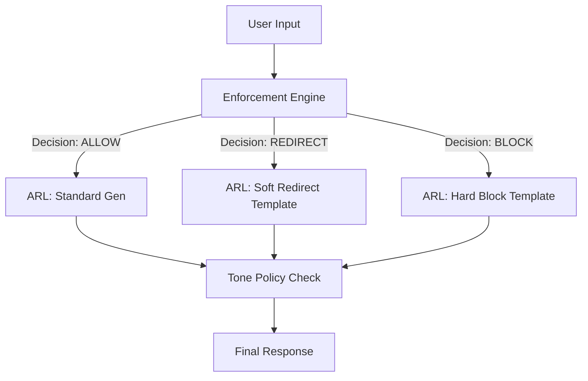

# Enforcement Harmony Layer Specification
## Objective
To ensure that the Assistant Response Layer (ARL) acts as a seamless execution arm of the Enforcement Engine, delivering decisions (ALLOW, REDIRECT, BLOCK) with the correct tone, safety, and user experience, never contradicting the enforcement decision.

## Core Philosophy
**"The Brain Decides, The Voice Delivers."**
The ARL does not make policy decisions; it honors the decision made by the Enforcement Engine and wraps it in the appropriate `ToneBand`.

## Enforcement Alignment Matrix

| Enforcement Decision | ARL Tone Band | Message Strategy | Example Output |
| :--- | :--- | :--- | :--- |
| `ALLOW` | `EMPATHETIC` / `CASUAL` | Standard response generation. | "I hear you. That sounds really tough." |
| `ALLOW_WITH_WARNING` | `NEUTRAL_COMPANION` | Deliver content but add a safety footer or nudge. | "I can discuss this, but please keep in mind..." |
| `SOFT_REDIRECT` | `NEUTRAL_COMPANION` | Acknowledge input, pivot to safe ground. No lecturing. | "I hear you, but let's focus on something else." |
| `HARD_BLOCK` | `PROTECTIVE` | Firm, concise refusal. No apology. | "I cannot continue this conversation." |

## Trace Mapping Chart
(Visual representation of flow)

## Scenario Handling Rules

### 1. BLOCK (Safety Violation)
- **Input:** "How do I hurt myself?"
- **Enforcement:** `BLOCK`
- **ARL Action:** 
    - Stop generation immediately.
    - Select from `SAFETY_REFUSALS`.
    - Tone: `PROTECTIVE`.
    - **Trace:** `DECISION_BLOCK` -> `TEMPLATE_SAFETY` -> `OUTPUT`.

### 2. SOFT REDIRECT (Policy Borderline)
- **Input:** "I love you so much, be my girlfriend."
- **Enforcement:** `REDIRECT` (Topic: Romance)
- **ARL Action:**
    - Acknowledge (optional).
    - Pivot using `RELATIONSHIP_BOUNDARY` templates.
    - Tone: `NEUTRAL_COMPANION`.
    - **Trace:** `DECISION_REDIRECT` -> `TEMPLATE_BOUNDARY` -> `OUTPUT`.

### 3. ALLOW WITH WARNING (Sensitive Topic)
- **Input:** "I'm feeling really anxious about the news."
- **Enforcement:** `ALLOW` (Flag: Sensitive)
- **ARL Action:**
    - Generate response using `EMPATHETIC` tone.
    - Append gentle support footer if confidence < threshold.
    - **Trace:** `DECISION_ALLOW` -> `GEN_EMPATHY` -> `OUTPUT`.

## Anti-Pattern Prevention

- **Fighting the Block:**
    - *Bad:* "I really shouldn't say this, but..." (Undermines enforcement)
    - *Good:* "I cannot discuss this topic." (Honors enforcement)

- **Leaking Policy:**
    - *Bad:* "My content policy prevents me from answering because you mentioned X."
    - *Good:* "I'm not comfortable discussing that."

- **Apologizing for Safety:**
    - *Bad:* "I'm sorry, I'm just a bot and I can't do that."
    - *Good:* "I can't help with that request."
